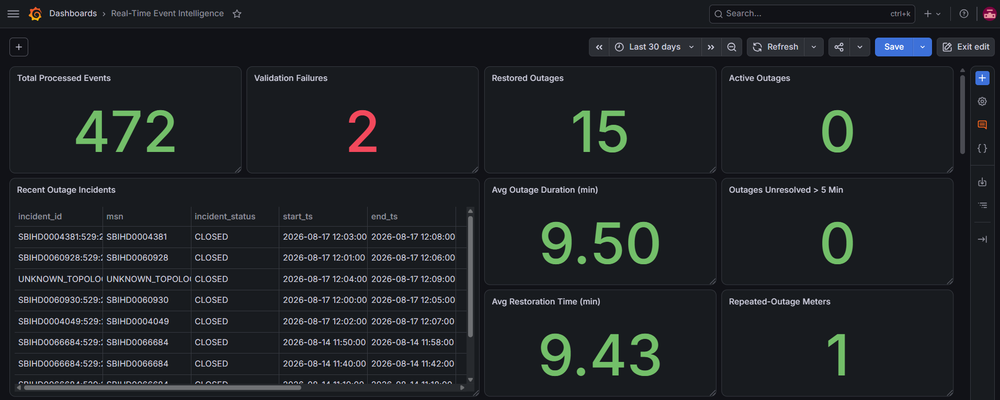
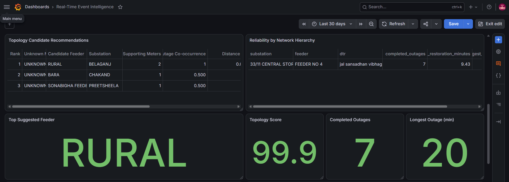
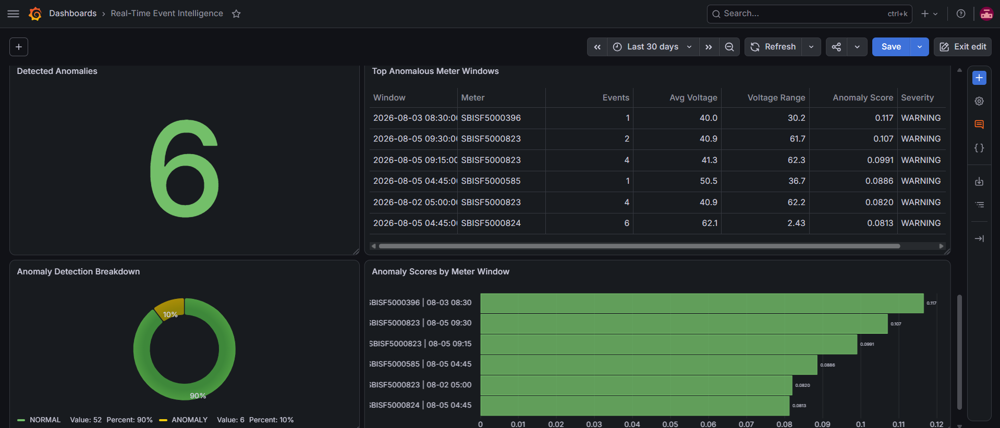

# Real-Time Event Intelligence Platform

A near-real-time smart-meter event analytics platform developed as part of a Software & Analytics internship at Esyasoft.

The platform simulates live smart-meter traffic from historical events, processes the stream through Apache Kafka and Apache Flink, applies modular operational and machine-learning analytics, persists results in ClickHouse, and visualizes outputs through Grafana.

> **Data Note:** Operational event datasets, network hierarchy reference data, trained model artifacts, and other non-public project data used during development are intentionally excluded from this repository.

---

## Architecture

```text
Historical Smart-Meter Events
          |
          v
Python Replay Producer
          |
          v
Apache Kafka
          |
          v
Apache Flink
   |-- Validation
   |-- Enrichment
   |-- Stateful Processing
   |-- Feature Engineering
   `-- Plugin-Based Analytics
          |
          v
Kafka Result Topics
          |
          v
ClickHouse
          |
          v
Grafana
```

The architecture separates event ingestion, stream processing, analytical logic, storage, and visualization so that multiple intelligence use cases can operate on the same enriched event stream.

---

## Technology Stack

- Python
- Java
- Apache Kafka
- Apache Flink
- ClickHouse
- Grafana
- Docker
- Docker Compose
- scikit-learn
- Maven

---

## Core Streaming Pipeline

The platform uses Kafka as the event backbone and Apache Flink for event-time stream processing.

Incoming smart-meter events move through the following stages:

1. Event validation
2. Event-catalogue enrichment
3. Network-topology enrichment
4. Stateful stream processing
5. 15-minute feature generation
6. Plugin-based analytical use cases
7. Kafka output topics
8. ClickHouse persistence
9. Grafana visualization

This design allows the processing backbone to remain reusable while analytical use cases are implemented independently.

---

## Plugin Architecture

Analytical use cases are implemented as independent plugins operating on the same enriched Flink stream.

Plugin configuration is defined in:

```text
flink-java/src/main/resources/usecases.json
```

Each enabled use case implements a common plugin interface and produces its own result stream.

This makes it possible to introduce additional analytical use cases without rebuilding the core ingestion and processing architecture.

---

## Implemented Use Cases

### 1. Outage Intelligence

Stateful stream-processing logic identifies:

- power-failure occurrences
- restoration events
- active outages
- unresolved outage conditions

The pipeline maintains meter-level outage state and produces structured outage incidents for downstream reliability analysis.

---

### 2. Supply Reliability Analytics

Processed outage events are persisted in ClickHouse and aggregated for operational monitoring through Grafana.

The resulting views support analysis of:

- outage frequency
- active incidents
- restoration activity
- outage duration
- network reliability behaviour

---

### 3. Topology Inference

A topology-inference plugin ranks likely feeder relationships for meters with uncertain topology information.

Candidate ranking combines:

- recent outage-event co-occurrence
- geographic proximity

The resulting topology score is a **heuristic ranking score and should not be interpreted as a probability**.

The use case demonstrates how streaming event behaviour can provide supporting evidence when network-topology information is incomplete or uncertain.

---

### 4. ML Anomaly Detection

An Isolation Forest model identifies unusual behaviour in streaming 15-minute smart-meter features.

The active feature set includes:

- `event_count_15m`
- `avg_voltage_15m`
- `voltage_range_15m`

The model is trained offline in Python and exported into a portable representation that can be evaluated directly inside the Java/Flink runtime.

Python and Java scoring implementations were validated for prediction parity during development.

---

## Streaming Feature Engineering

The shared feature pipeline creates 15-minute tumbling-window features including:

```text
event_count_15m
avg_voltage_15m
voltage_range_15m
power_failure_count_15m
```

Processing uses event-time timestamps with bounded out-of-order handling.

These reusable features can be consumed by multiple downstream intelligence plugins.

---

## Kafka Topics

The platform uses dedicated Kafka topics for different processing stages and analytical outputs.

```text
smart-meter-events
processed-smart-meter-events
meter-features-15m
outage-incidents
topology-inference-results
anomaly-detection-results
```

This keeps ingestion, processed events, features, and analytical outputs logically separated.

---

## ClickHouse Persistence

Streaming outputs are persisted using the pattern:

```text
Kafka Engine Table
        |
        v
Materialized View
        |
        v
MergeTree Table
```

Persisted datasets include:

- processed smart-meter events
- 15-minute meter features
- outage incidents
- topology inference results
- anomaly detection results

SQL definitions are available under:

```text
clickhouse/sql/
```

---

## Grafana Dashboards

Grafana provides operational and analytical views across the streaming platform.

Dashboard coverage includes:

- real-time event processing
- outage monitoring
- supply reliability
- topology inference
- anomaly detection
- anomaly-score ranking

### Operational Outage Overview



### Topology and Network Reliability



### ML Anomaly Detection



The exportable Grafana dashboard configuration is also included:

```text
dashboard/real_time_event_intelligence_dashboard.json
```

---

## Project Structure

```text
real-time-event-intelligence/
|
|-- clickhouse/
|   `-- sql/
|
|-- dashboard/
|   |-- final/
|   `-- real_time_event_intelligence_dashboard.json
|
|-- enrichment/
|
|-- flink/
|   `-- sql/
|
|-- flink-java/
|   |-- pom.xml
|   `-- src/
|
|-- ml/
|   |-- train_isolation_forest.py
|   |-- export_isolation_forest_json.py
|   `-- validate_isolation_forest_json.py
|
|-- outage/
|   `-- outage_service.py
|
|-- producer/
|   `-- replay_producer.py
|
|-- docker-compose.example.yml
|-- .env.example
|-- requirements.txt
`-- README.md
```

---

## Local Infrastructure

A sanitized Docker Compose configuration is provided as:

```text
docker-compose.example.yml
```

Environment-variable placeholders are provided in:

```text
.env.example
```

Start the local infrastructure with:

```bash
docker compose -f docker-compose.example.yml up -d
```

Default local interfaces include:

- Flink: `http://localhost:8081`
- Grafana: `http://localhost:3000`
- ClickHouse HTTP: `http://localhost:8123`
- Kafka: `localhost:9092`

---

## Flink Runtime

The primary Java/Flink implementation is located under:

```text
flink-java/
```

The project uses Maven to build the Flink runtime.

```bash
cd flink-java
mvn clean package
```

The resulting runtime contains the shared processing pipeline and configurable analytical plugins.

Reference datasets and trained model artifacts used during the original development environment are intentionally not included in this public repository.

---

## Event Replay

Historical smart-meter events were replayed as a simulated live stream using:

```text
producer/replay_producer.py
```

The replay producer supports accelerated playback while preserving source event timestamps for Flink event-time processing.

Example usage:

```bash
python producer/replay_producer.py \
  --file <event-file.jsonl> \
  --speed 3600 \
  --timing-field ts
```

The source dataset itself is not included in this repository.

---

## ML Workflow

The anomaly-detection workflow is separated into offline training and streaming inference.

Python utilities include:

```text
ml/train_isolation_forest.py
ml/export_isolation_forest_json.py
ml/validate_isolation_forest_json.py
```

The workflow consists of:

1. Generate 15-minute analytical features
2. Train an Isolation Forest model in Python
3. Export the model into a portable representation
4. Load the representation in the Java/Flink runtime
5. Score streaming feature windows
6. Publish anomaly results to Kafka
7. Persist results in ClickHouse
8. Visualize anomaly behaviour in Grafana

Trained artifacts derived from non-public operational data are intentionally excluded.

---

## Safe Shutdown

The active Flink job should be cancelled before shutting down the local infrastructure.

The remaining services can then be stopped with:

```bash
docker compose -f docker-compose.example.yml stop
```

Persistent volumes should only be removed intentionally.

---

## Repository Scope

This repository focuses on the engineering implementation and selected non-sensitive project evidence.

The following are intentionally excluded:

- operational smart-meter event datasets
- network hierarchy and master data
- internal working documentation
- trained models derived from operational data
- runtime state files
- credentials
- local environment configuration
- temporary development outputs
- backup source files

The repository therefore demonstrates the system architecture, implementation approach, analytical logic, and dashboard outputs without publishing non-public operational data.

---

## Key Outcomes

The project demonstrates practical implementation of:

- historical-to-real-time event replay
- Kafka-based streaming ingestion
- Apache Flink event-time processing
- event validation and enrichment
- stateful outage processing
- reusable 15-minute feature engineering
- modular plugin-based analytics
- supply reliability analysis
- topology inference
- Isolation Forest anomaly detection
- Python-to-Java ML model integration
- ClickHouse analytical persistence
- Grafana operational visualization

Overall, the project explores how a reusable streaming architecture can transform raw smart-meter events into operational intelligence while supporting multiple analytical use cases on a shared event-processing backbone.
