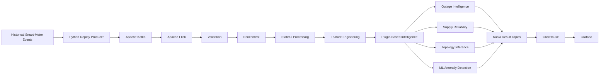
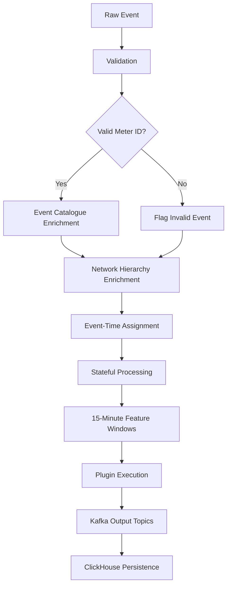
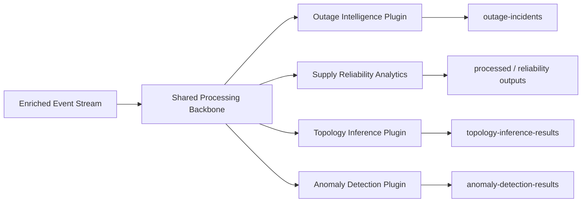
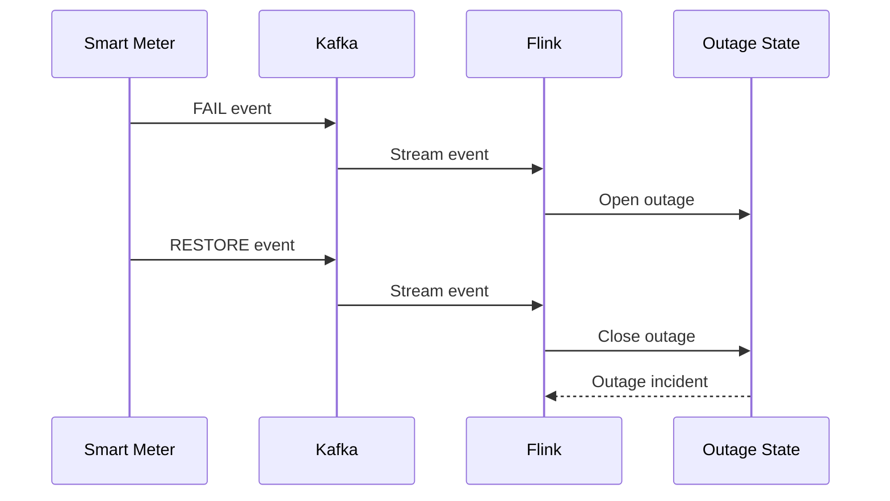
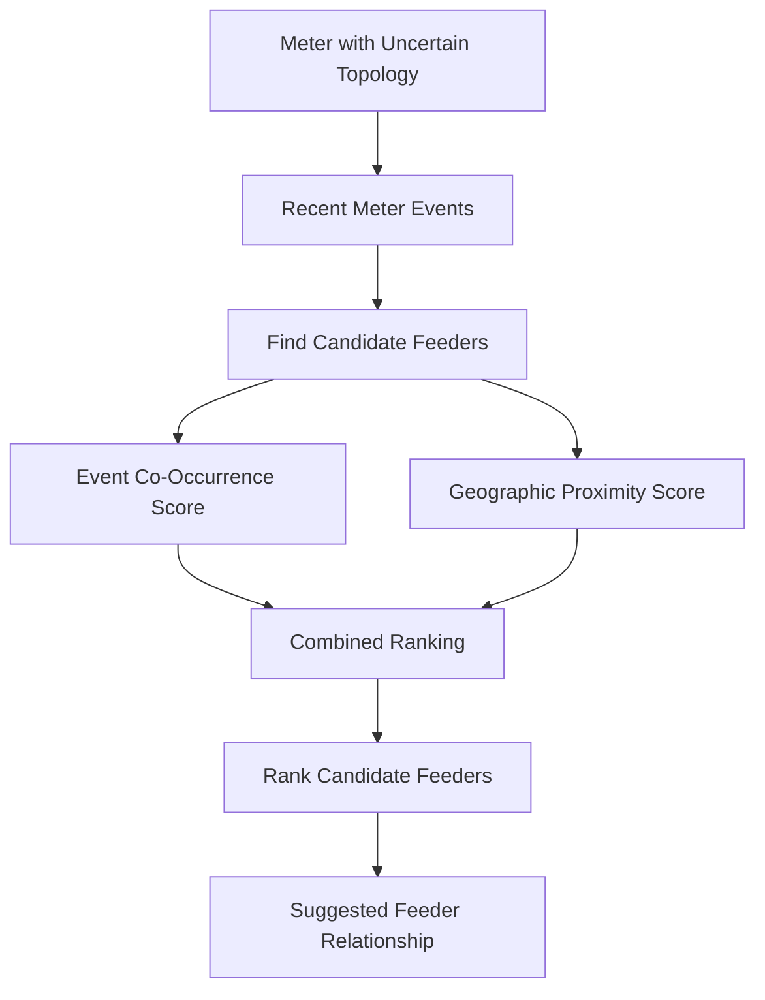
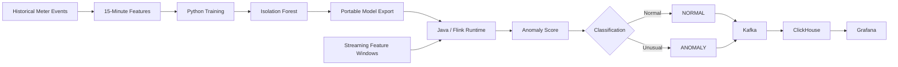
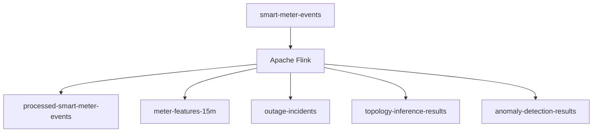
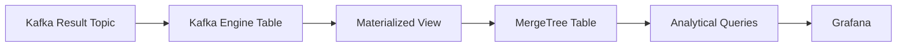
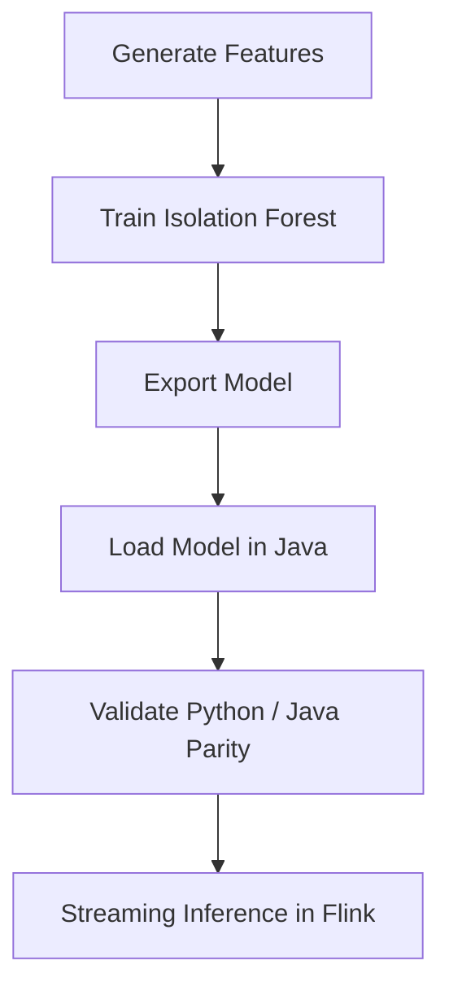
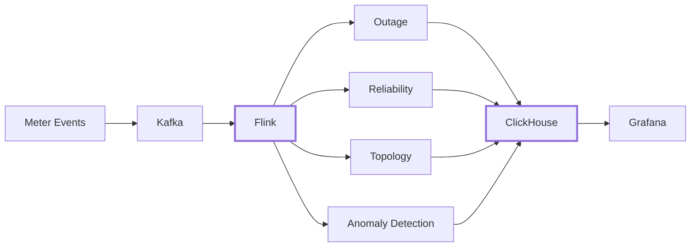

# Real-Time Event Intelligence Platform

> A modular near-real-time smart-meter analytics platform built with **Apache Kafka, Apache Flink, ClickHouse, Grafana, Python, Java and machine learning**.

Developed as part of a Software & Analytics internship at Esyasoft, this project explores how raw smart-meter events can be transformed into operational intelligence through streaming ingestion, event-time processing, stateful analytics and ML-based detection.

The platform replays historical events as a simulated live stream, processes them through a reusable Flink pipeline, executes multiple analytical plugins, persists outputs in ClickHouse and visualizes results in Grafana.

> **Data Privacy:** Operational datasets, network hierarchy data, trained model artifacts and other non-public project data are intentionally excluded from this repository.

---

## Platform Overview



### Core Flow

**Events → Kafka → Flink → Intelligence Plugins → ClickHouse → Grafana**

The architecture separates ingestion, stream processing, analytical logic, storage and visualization so that multiple use cases can operate on the same enriched event stream.

---

## Technology Stack

| Layer | Technologies |
|---|---|
| Event Simulation | Python |
| Streaming Backbone | Apache Kafka |
| Stream Processing | Apache Flink, Java |
| Feature Engineering | Flink event-time windows |
| Machine Learning | Isolation Forest, scikit-learn |
| Analytical Storage | ClickHouse |
| Visualization | Grafana |
| Infrastructure | Docker, Docker Compose |
| Build Tool | Maven |

---

## Streaming Processing Pipeline

Incoming smart-meter events pass through a reusable processing backbone before being exposed to analytical plugins.



The shared pipeline handles:

- event validation
- event catalogue enrichment
- network topology enrichment
- event-time processing
- stateful operations
- reusable feature generation
- plugin execution
- downstream persistence

---

## Modular Plugin Architecture

The platform was designed so that new analytical use cases can be added without rebuilding the entire streaming pipeline.



Plugin configuration is maintained in:

```text
flink-java/src/main/resources/usecases.json
```

Each analytical module operates independently on the enriched stream while sharing the same ingestion, validation and processing backbone.

---

# Intelligence Use Cases

## 1. Outage Intelligence

Stateful stream-processing logic identifies power-failure occurrences and restoration events while maintaining meter-level outage state.

The use case supports:

- power-failure detection
- restoration detection
- active outage tracking
- unresolved outage identification
- structured outage incident generation



---

## 2. Supply Reliability Analytics

Outage events are persisted in ClickHouse and aggregated for operational monitoring.

The resulting analytical layer supports investigation of:

- outage frequency
- active incidents
- restoration activity
- outage duration
- network reliability behaviour

### Operational Dashboard


---

## 3. Topology Inference

The topology inference module evaluates likely feeder relationships for meters with incomplete or uncertain network information.

Candidate ranking combines:

- outage-event co-occurrence
- geographic proximity evidence



The resulting topology score is a **heuristic ranking score rather than a probability**.

### Topology & Network Reliability Dashboard


---

## 4. ML Anomaly Detection

An Isolation Forest model identifies unusual behaviour in streaming 15-minute smart-meter features.

### Feature Set

```text
event_count_15m
avg_voltage_15m
voltage_range_15m
```

The ML workflow separates offline model development from streaming inference.



The Python and Java scoring implementations were validated for prediction parity during development.

### ML Anomaly Detection Dashboard


---

# Shared Streaming Features

The Flink pipeline generates reusable 15-minute tumbling-window features:

| Feature | Purpose |
|---|---|
| `event_count_15m` | Number of events within the window |
| `avg_voltage_15m` | Mean voltage behaviour |
| `voltage_range_15m` | Voltage variation within the window |
| `power_failure_count_15m` | Power-failure activity |

Processing uses **event-time timestamps** and bounded out-of-order handling.

This feature layer can be reused across multiple downstream analytical plugins.

---

# Kafka Event Backbone

Dedicated Kafka topics isolate different stages and analytical outputs.



### Main Topics

```text
smart-meter-events
processed-smart-meter-events
meter-features-15m
outage-incidents
topology-inference-results
anomaly-detection-results
```

---

# ClickHouse Analytical Storage

Streaming results are persisted using a Kafka-to-ClickHouse pattern.



Persisted outputs include:

- processed smart-meter events
- 15-minute feature windows
- outage incidents
- topology inference results
- anomaly detection results

SQL definitions are available under:

```text
clickhouse/sql/
```

---

# Grafana Analytics

Grafana provides the operational visualization layer for the platform.

Dashboard views include:

- real-time event processing
- outage monitoring
- supply reliability
- topology inference
- anomaly detection
- anomaly-score ranking

The exportable dashboard configuration is included at:

```text
dashboard/real_time_event_intelligence_dashboard.json
```

---

# Project Structure

```text
real-time-event-intelligence/
│
├── clickhouse/
│   └── sql/
│       ├── 01_event_intelligence_schema.sql
│       └── 02_active_event_intelligence_schema.sql
│
├── dashboard/
│   ├── final/
│   │   ├── 01_operational_outage_overview.png
│   │   ├── 02_topology_network_reliability.png
│   │   └── 03_anomaly_detection.png
│   │
│   └── real_time_event_intelligence_dashboard.json
│
├── enrichment/
│   └── enrichment_service.py
│
├── flink/
│   └── sql/
│
├── flink-java/
│   ├── pom.xml
│   └── src/
│       └── main/
│           ├── java/
│           └── resources/
│
├── ml/
│   ├── train_isolation_forest.py
│   ├── export_isolation_forest_json.py
│   └── validate_isolation_forest_json.py
│
├── outage/
│   └── outage_service.py
│
├── producer/
│   └── replay_producer.py
│
├── docker-compose.example.yml
├── .env.example
├── requirements.txt
└── README.md
```

---

# Local Infrastructure

A sanitized Docker Compose configuration is provided:

```text
docker-compose.example.yml
```

Environment placeholders are available in:

```text
.env.example
```

Start the infrastructure with:

```bash
docker compose -f docker-compose.example.yml up -d
```

### Local Interfaces

| Service | Address |
|---|---|
| Apache Flink | `localhost:8081` |
| Grafana | `localhost:3000` |
| ClickHouse HTTP | `localhost:8123` |
| Kafka | `localhost:9092` |

---

# Flink Runtime

The main streaming implementation is located in:

```text
flink-java/
```

Build the Java runtime using Maven:

```bash
cd flink-java
mvn clean package
```

The runtime contains:

- validation logic
- event enrichment
- hierarchy enrichment
- event-time handling
- stateful outage processing
- feature generation
- plugin loading
- topology inference
- ML anomaly scoring

Reference datasets and trained model artifacts used during the original development environment are intentionally excluded.

---

# Event Replay

Historical events are converted into a simulated live stream using:

```text
producer/replay_producer.py
```

The producer:

- reads historical JSONL events
- preserves original event timestamps
- supports accelerated replay
- publishes events to Kafka
- records replay timestamps

Example:

```bash
python producer/replay_producer.py \
  --file <event-file.jsonl> \
  --speed 3600 \
  --timing-field ts
```

The operational source dataset is not included in this repository.

---

# ML Workflow

The ML implementation is separated into training, export and runtime validation.

```text
ml/
├── train_isolation_forest.py
├── export_isolation_forest_json.py
└── validate_isolation_forest_json.py
```



This approach allows model development to remain in Python while production-style inference occurs directly inside the stream-processing runtime.

---

# Repository Scope & Privacy

This repository focuses on the **engineering implementation and selected non-sensitive project evidence**.

The following are intentionally excluded:

- operational smart-meter event datasets
- network hierarchy and master data
- internal working documentation
- trained model artifacts derived from operational data
- runtime state files
- credentials
- private environment configuration
- temporary development outputs
- source-code backups

This preserves the system architecture, analytical logic and implementation approach without exposing non-public operational information.

---

# Key Outcomes

The project demonstrates practical implementation of:

- Kafka-based streaming ingestion
- historical-to-real-time event replay
- Apache Flink event-time processing
- event validation and enrichment
- network hierarchy enrichment
- stateful outage detection
- reusable feature engineering
- modular plugin-based analytics
- supply reliability analysis
- topology inference
- Isolation Forest anomaly detection
- Python-to-Java ML integration
- ClickHouse analytical persistence
- Grafana operational visualization

---

## Final System



**One event-processing backbone. Multiple intelligence use cases. Real-time operational analytics.**
